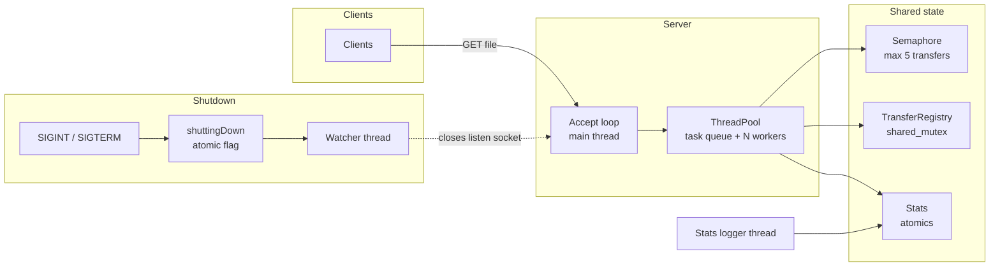

# multithreaded-file-transfer-server

```mermaid
flowchart LR
    subgraph Clients
        C[Clients]
    end

    subgraph Server
        ACC[Accept loop<br/>main thread]
        POOL[ThreadPool<br/>task queue + N workers]
    end

    subgraph Shared state
        SEM[Semaphore<br/>max 5 transfers]
        REG[TransferRegistry<br/>shared_mutex]
        STATS[Stats<br/>atomics]
    end

    subgraph Shutdown
        SIG[SIGINT / SIGTERM] --> FLAG[shuttingDown<br/>atomic flag]
        FLAG --> WATCH[Watcher thread]
    end

    C -->|GET file| ACC --> POOL
    POOL --> SEM
    POOL --> REG
    POOL --> STATS
    LOG[Stats logger thread] --> STATS
    WATCH -.->|closes listen socket| ACC
```
