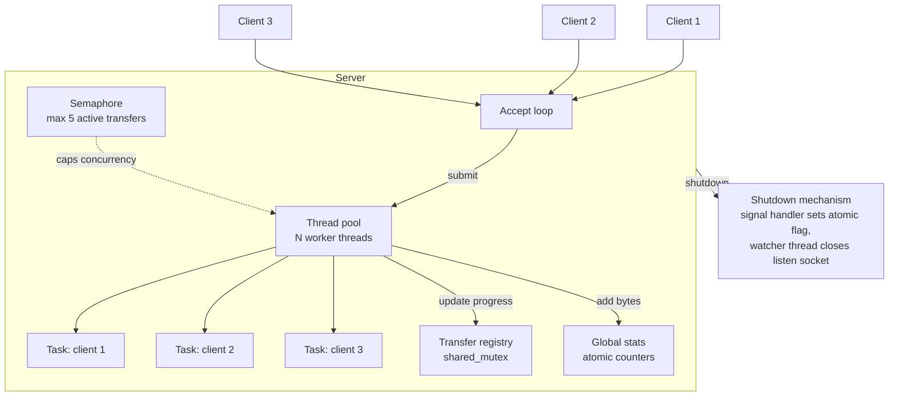

# multithreaded-file-transfer-server

```mermaid
flowchart TD
    C1[Client 1]
    C2[Client 2]
    C3[Client 3]

    subgraph SERVER[Server]
        ACC[Accept loop]
        POOL[Thread pool<br/>N worker threads]
        SEM[Semaphore<br/>max 5 active transfers]
        T1[Task: client 1]
        T2[Task: client 2]
        T3[Task: client 3]
        REG[Transfer registry<br/>shared_mutex]
        STATS[Global stats<br/>atomic counters]
    end

    SHUT[Shutdown mechanism<br/>signal handler sets atomic flag,<br/>watcher thread closes listen socket]

    C1 --> ACC
    C2 --> ACC
    C3 --> ACC
    ACC -->|submit| POOL
    POOL --> T1
    POOL --> T2
    POOL --> T3
    SEM -.->|caps concurrency| POOL
    POOL -->|update progress| REG
    POOL -->|add bytes| STATS
    SERVER -->|shutdown| SHUT
```
