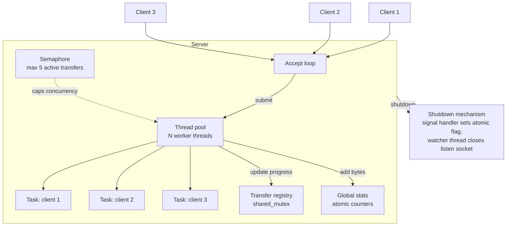

# multithreaded-file-transfer-server
A C++ multithreaded TCP file transfer server , i built it mainly to practice multithreading concepts from
*C++ Concurrency in Action* book, i also practiced  raw socket programming and Qt GUI development.

Clients connect over TCP, request a file by name, and download it with live
progress tracking. The server handles multiple simultaneous transfers using a
thread pool, with a semaphore-based cap on concurrent transfers, a shared
transfer-progress registry, and atomic global stats.
Developed and tested on Linux (via WSL2 on Windows).

## Project structure

```
server/         Multithreaded TCP server — socket handling, thread pool, transfer registry
thread_pool/    Custom thread pool (ThreadPool class)
client_cli/     Minimal CLI test client used during early development(this was just for testing)
client_gui/     Qt Widgets desktop client with live progress tracking
shared_files/   Files the server hosts and makes available for download this is where the downloadable files live
```
## Core concepts practiced 

**(`std::thread`)**
the thread pool was built on c++ std::thread which is the c++ standard wrapper around OS level threads(cross platform). the most important thing to 
clear here is that i dont spawn a thread for every client connection thats way too expensive, instead a fixed number of threads is created at startup each one running a loop that waits for work Work is handed to the pool via a shared task queue (`std::queue<std::function<void()>>`).
`submit()` pushes a task onto the queue; idle worker threads wait on the queue and pick up tasks as they arrive

...

**`std::mutex` vs `std::shared_mutex`**
One of the most important concepts I practiced in this project is mutexes,specifically the difference between `std::mutex` and `std::shared_mutex`.`std::mutex` has only one locking mode — only one thread can hold it, andevery other thread, reader or writer, blocks until it's released.`std::shared_mutex` has two locking modes, and which one activates dependson which lock type you pass it to. If you lock it with a `std::unique_lock`,that's the same behavior as a regular mutex  only one thread can hold it,blocking everyone else  and we use that mode when we need to *write* thedata being protected. The second mode is locking it with a `std::shared_lock`,which allows multiple threads to hold it at the same time, and we use that mode when we only need to *read* the data, since concurrent reads don'tconflict with each other the way a write does
...

**`std::lock_guard` vs `std::unique_lock` vs `std::shared_lock`**
one of the essential concurrency concepts is using locks and knowing which type of lock to use depending in your case , all three types of locks are just RAII wrappers (lock in the constructor, unlock in the destructor). lock guard is the simplest one it locks once and holds that lock for the rest of its scope and unlocks automatically when it goes out of scope.Nothing else no manual unlock or anything.unique_lock adds some flexibility you can manually `.unlock()` and even re-lock it later in the same scope,construct it without locking immediately (`std::defer_lock`), and it's movable, which `lock_guard` is not. shared_lock is basically the same as unique_lock but in a shared mode way which means that it allows multiple threads to hold that lock at the same time
...

**`std::condition_variable`**
i used a condition variable to let a thread sleep with zero cpu usage  until another thread wakes it instead of waiting in a loop checking a condition repeatedly it has a method called wait which takes  two arguments a lock and a predicate which returns true or false when we call wait on the condition variable it checks  the predicate if it returns true it returns immediately and keeps the lock locked and continues executing code, if the predicate returns false it unlocks the lock and puts the current thread to sleep until another thread calls notify_one or notify_all the thread wakes up and checks the predicate again
Used in the thread pool's worker loop workers sleep until`submit()` calls `notify_one()`, or shutdown calls `notify_all()`
...

**Counting semaphore**
semaphore caps how many threads can execute a specific area of code at the same time. i implemented a semaphore from scratch in this project and its actually quite easy to implement all you need are a count number member a mutex and a condition variable and it mainly has two methods , first one is acquire which lets a thread claim one of the available slots, its implementation is quite easy, you lock the mutex , call wait on the condition variable and pass a predicate to it that returns count > 0 if that is true that means there is an available slot so wait returns immediately and then we decrement the counte because now a slot is taken. the second method is release and its the opposite of acquire , all we do is lock the mutex and increment the count because now a slot has been freed 
...

**`std::atomic`**
For simple counters like total bytes transferred and active transfer count(`server/`), a `std::atomic` is enough  no mutex needed. The hardware guarantees operations like `+=` or `++` on an atomic variable complete as a single indivisible step, so concurrent updates from multiple threads can't interleave and corrupt the value
...
## Build & run

### Prerequisites
- CMake, g++/clang++
- Qt 6 (Widgets + Network modules) — for the GUI client

### Building the server
```bash
cmake -B build
cmake --build build --target server
```

### Running the server
```bash
./build/server/server
```

### Building the GUI client
```bash
cmake --build build --target client_gui
```

### Running the GUI client
```bash
./build/client_gui/client_gui
```
Enter a filename (must exist in `shared_files/`) and click Download.  

## Platform support
The server uses POSIX sockets and signal handling (`sigaction`), so it runs
on Linux and macOS, including Windows via WSL2 — but not natively on Windows
without porting to Winsock. The Qt GUI client is cross-platform and runs
natively on Windows, Linux, and macOS.
