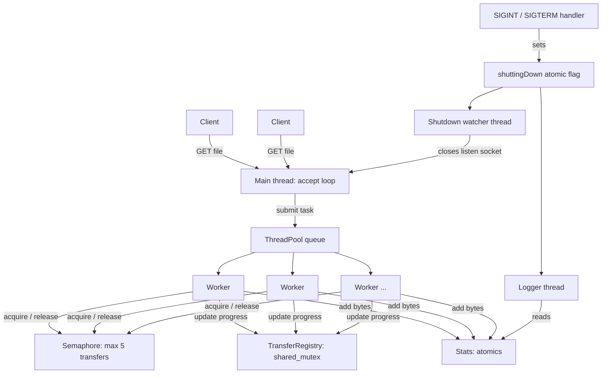

# multithreaded-file-transfer-server

```mermaid
flowchart TD
    C1[Client] -->|GET file| ACC[Main thread: accept loop]
    C2[Client] -->|GET file| ACC
    ACC -->|submit task| POOL[ThreadPool queue]
    POOL --> W1[Worker]
    POOL --> W2[Worker]
    POOL --> WN[Worker ...]

    W1 & W2 & WN -->|acquire / release| SEM[Semaphore: max 5 transfers]
    W1 & W2 & WN -->|update progress| REG[TransferRegistry: shared_mutex]
    W1 & W2 & WN -->|add bytes| STATS[Stats: atomics]

    LOG[Logger thread] -->|reads| STATS
    SIG[SIGINT / SIGTERM handler] -->|sets| FLAG[shuttingDown atomic flag]
    FLAG --> WATCH[Shutdown watcher thread]
    WATCH -->|closes listen socket| ACC
    FLAG --> LOG
```
